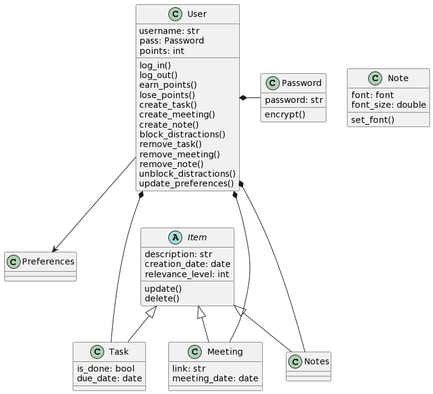

# AJCalender
## ¿Cómo usar?
Primero debes instalar los paquetes necesarios. Para esto, abre cmd desde la carpeta y escribe pip install -r requirements.txt.
Una vez hecho esto, ejecuta el archivo main.py. Ingresa con tu usuario y contraseña si ya tienes uno, sino regístrate. Una vez iniciado sesión, podrás ver interactuar con los botones de crear tareas, reuniones y notas. Al presionarlos, podrás crear cualquiera de estos tres items. Para ver la lista de tareas, reuniones y notas, debes presionar en las opciones de la derecha, dónde se abrirá la lista los items. 
## UML

