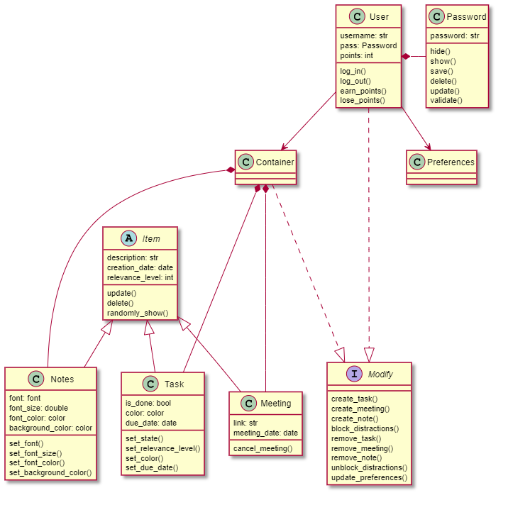

# AJCalender
## Cómo usar
Clonar el repositorio y ejecutar el archivo main.py. Luego, ingresar como usuario "Default" y como contraseña "1234". Agregamos la funcionalidad
de agregar tareas. Primero debe presionar el botón "Agregar tarea", en la ventana emergente escribir la descripción, seleccionar el nivel de relevancia, escribir el color (aún no implementada la  modificación del texto), escribir la fecha límite en el siguiente formato: "DD-MM-AA" y por último seleccionar si la tarea está hecha o se encuentra por hacer. 
## UML
<<<<<<< HEAD
/assets/images/uml.bmp
=======

>>>>>>> e252a93437134d3d52b78c02aa20cfb028d55413
