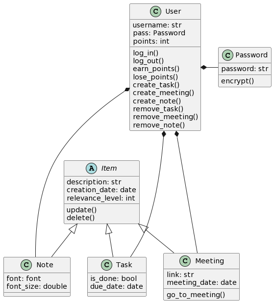

# AJCalendar
## ¿Qué es?
AJCalendar es una aplicación para windows que ayuda a gestionar las notas, tareas y reuniones que tengas pendientes. Ofrece la capacidad de crear un usuario para que tu lista de quehaceres o notas sea completamente privada. Además, te recordará a la hora exacta las reuniones que tengas pendientes.
## ¿Cómo usar?
Primero debes instalar los paquetes necesarios. Para esto, abre cmd desde la carpeta y escribe pip install -r requirements.txt.
Una vez hecho esto, ejecuta el archivo main.py. Ingresa con tu usuario y contraseña si ya tienes uno, sino regístrate. Una vez iniciado sesión, podrás ver interactuar con los botones de crear tareas, reuniones y notas. Al presionarlos, podrás crear cualquiera de estos tres items. Para ver la lista de tareas, reuniones y notas, debes presionar en las opciones de la derecha, dónde se abrirá la lista los items. 

## Functional requirements
- La aplicación guarda los quehaceres en base de datos sqlite3, así como la información del usuario que ingresa estos quehaceres.
- La aplicación le recuerda al usuario las reuniones pendientes a la hora exacta que las tiene.
- La aplicación permite la modificación de la base de datos sqlite3 mediante una interfaz gráfica.
- La aplicación cifra las contraseñas de los usuarios utilizando el módulo security del paquete werkzeug para python 3.8.7.

## Non-Functional requirements
- La aplicación ofrece privacidad.
- La aplicación es amigable con el usuario.
- La aplicación tiene un tiempo de respuesta rápido.

## Tecnologías usadas
Esta aplicación fue desarrollada en python 3.8.7. Para la interfaz gráfica se utilizó la librería Tkinter y sus múltiples módulos, además, para mejora gráfica utilizamos el módulo windll de la librería ctypes. Por otra parte, para el tema de base de datos, utilizamos sqlite3 que ya viene instalado en python 3.8.7 y el paquete werkzeug para el cifrado de contraseñas. Por último, el diseño de botones lo realizamos mediante figma.
## UML

